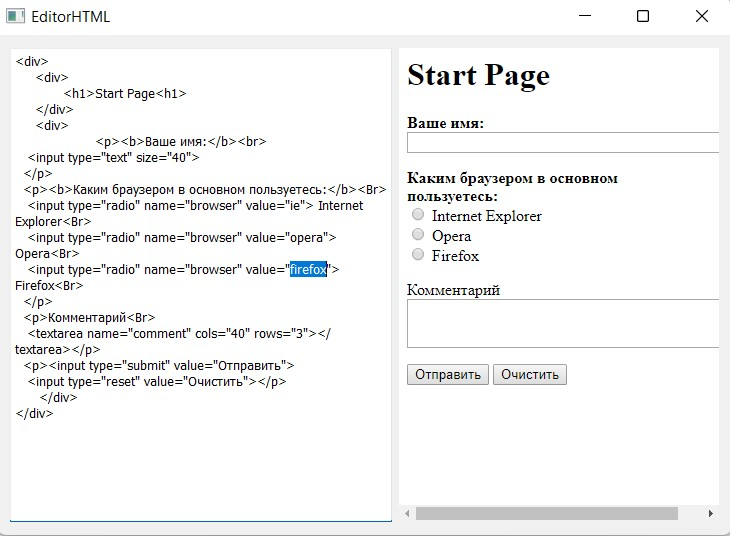

# EditorHtml

## Описание

Приложение представляет собой редактор html-кода. В этом приложении окно разделено на две половины. В левой половине вы можно редактировать HTML-документ, а в правой половине можно увидеть результат WebView.

## Инструкция по подключению библиотек

В проекте уже сгенирован файл конфигурации [CMakeLists.txt](CMakeLists.txt).

## Инструкция по сборке

Сборка проекта производится с помощью инструмента [CMake](https://cmake.org/). В терминале компьютера необходимо прописать следующие команды: 

```
cmake --build . --config Release --target main
```

## Интерфейс


